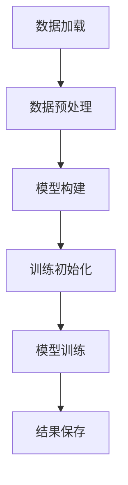

# GIDDM: 高光谱图像域适应项目

## 📋 项目简介

GIDDM是一个基于深度学习的高光谱图像域适应项目，旨在解决不同域之间的数据分布差异问题，提高模型在目标域上的泛化性能。

## ✨ 主要特性

- 🚀 支持多种高光谱数据集（Houston、Pavia、KSC等）
- 🔧 提供多种网络架构选择（ResNet50、Cc2Net87、DCRN_02等）
- 📊 实现多种域适应算法（GIDDM、cGIDDM等）
- 🎯 针对高光谱图像特点优化的数据处理流程
- 📈 完整的训练和评估框架

## 🛠️ 环境要求

| 依赖项 | 版本要求 |
|--------|----------|
| Python | 3.6+ |
| PyTorch | 1.7+ |
| CUDA | 10.0+ (可选，用于GPU加速) |
| 其他依赖 | 见requirements.txt |

## 📦 安装说明

### 1. 克隆项目
```bash
git clone [项目地址]
cd GIDDM
```

### 2. 安装依赖
```bash
pip install -r requirements.txt
```

### 3. 准备数据集
- 将数据集文件放置在`data/`目录下
- 确保数据格式符合要求（.mat文件）

## 📚 数据集准备

### 支持的数据集

#### 🏙️ Houston数据集
| 项目 | 详情 |
|------|------|
| **源域** | `Houston13.mat` |
| **目标域** | `Houston18.mat` |
| **训练文件** | `train_HS.py` |

#### 🏛️ Pavia数据集
| 项目 | 详情 |
|------|------|
| **源域** | `paviaC.mat` |
| **目标域** | `paviaU.mat` |
| **训练文件** | `train-Pavia.py` |

### 📋 数据格式要求

- ✅ 数据文件应为`.mat`格式
- ✅ 标签文件应包含对应的ground truth信息
- ✅ 数据应按照指定的目录结构组织

## 🚀 使用方法

### 基本训练命令

#### 训练Houston数据集
```bash
python train_HS.py
```

#### 训练Pavia数据集
```bash
python train-Pavia.py
```

### 配置参数

主要配置参数在`config_HSI_PCPU.py`文件中定义：

#### 📊 数据级参数
| 参数 | 说明 | 示例值 |
|------|------|--------|
| `--dataset` | 数据集名称 | Houston, Pavia |
| `--target_domain` | 目标域名称 | Houston18, paviaU |
| `--seed` | 随机种子 | 42 |

#### 🧠 模型级参数
| 参数 | 说明 | 示例值 |
|------|------|--------|
| `--model` | 模型类型 | GIDDM, cGIDDM |
| `--net` | 网络架构 | resnet50, Cc2Net87, DCRN_02 |
| `--bottle_neck_dim` | 瓶颈层维度 | 256 |
| `--patches` | 图像块大小 | 7 |

#### ⚙️ 训练级参数
| 参数 | 说明 | 示例值 |
|------|------|--------|
| `--batch_size` | 批次大小 | 256 |
| `--lr` | 学习率 | 0.001 |
| `--training_iter` | 训练迭代次数 | 10000 |
| `--warmup_iter` | 预热迭代次数 | 1000 |

### 训练示例

#### 🎯 标准训练
```bash
# Pavia数据集
python train-Pavia.py

# Houston数据集
python train_HS.py
```

#### 🔧 自定义参数训练

##### Houston数据集
```bash
python train_HS.py \
    --dataset Houston \
    --source_domain Houston13 \
    --target_domain Houston18 \
    --batch_size 256 \
    --lr 0.001
```

##### Pavia数据集
```bash
python train-Pavia.py \
    --dataset Pavia \
    --source_domain paviaC \
    --target_domain paviaU \
    --batch_size 256 \
    --lr 0.001
```

### 🔄 模型训练流程



1. **📥 数据加载**: 从指定路径加载源域和目标域数据
2. **🔧 数据预处理**: 进行标签映射和数据增强
3. **🏗️ 模型构建**: 初始化GIDDM模型
4. **⚙️ 训练初始化**: 设置训练参数和优化器
5. **🚀 模型训练**: 执行域适应训练
6. **💾 结果保存**: 保存训练结果和模型

## 📁 项目结构

```
GIDDM/
├── 📄 config_HSI_PCPU.py          # 配置文件
├── 🐍 train_HS.py                 # Houston数据集训练脚本
├── 🐍 train-Pavia.py              # Pavia数据集训练脚本
├── 🧠 models/                     # 模型定义
│   ├── model_PCPU_HSI.py         # GIDDM模型实现
│   ├── model_HSI_HS.py           # HSI模型实现
│   ├── basenet.py                # 基础网络
│   └── function.py                # 工具函数
├── 📊 data_loader/                # 数据加载器
│   ├── get_loader.py             # 数据加载接口
│   ├── mydataset.py              # 数据集类
│   └── base.py                   # 基础数据类
├── 📁 data/                       # 数据集目录
│   ├── Houston/                  # Houston数据集
│   ├── Pavia/                    # Pavia数据集
│   ├── KSC/                      # KSC数据集
│   └── office/                   # Office数据集
├── 🛠️ utils/                      # 工具函数
├── 📈 results/                    # 结果保存目录
└── 📖 README.md                   # 项目说明文档
```

## 📚 引用

如果您在研究中使用了本项目，请引用相关论文：

```bibtex
[相关论文引用信息]
```

## 📄 许可证

本项目采用MIT许可证，详见LICENSE文件。

## 🤝 贡献

欢迎提交Issue和Pull Request来改进项目！

- 🐛 报告Bug
- 💡 提出新功能建议
- 📝 改进文档
- 🔧 贡献代码

## 📞 联系方式

如有问题，请通过以下方式联系：

- 📧 邮箱：[wanghaoyucumt@163.com]
- 🐙 GitHub Issues：[项目地址]/issues

---

<div align="center">

**⭐ 如果这个项目对您有帮助，请给我们一个星标！ ⭐**

</div>

